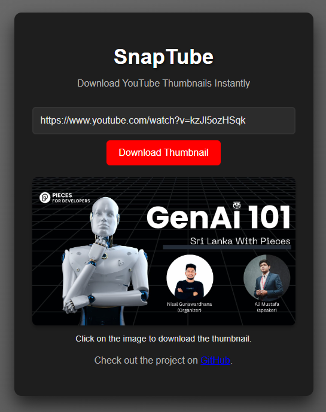

# SnapTube

SnapTube is a simple, lightweight web application that allows users to download YouTube video thumbnails effortlessly. By entering a YouTube video URL, users can preview the video thumbnail and download it with a single click.

This project was inspired by **"GenAI 101 with Pieces event In Sri Lanka"**, a session led by **Ali Mustufa**. The session provided valuable insights into the exciting world of Generative AI, its workflows, and best practices for applying AI in creative and technical projects.

A huge thanks to **Ali Mustufa** for sharing invaluable expertise on Generative AI and to **Nisal Gunawardhana** for organizing this insightful and engaging session.

